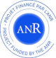

<link rel="stylesheet" href="styles/retro.css">
<link rel="stylesheet" href="styles/images.css">

## First Multimodal Banquet: Exploring Innovative Technology for Commensality and Human-Food Interaction (CoFI2024)

### Held in conjunction with ICMI2024 (Costa Rica) <https://icmi.acm.org/2024>

## Organisers

 
Radoslaw Niewiadomski (radoslaw.niewiadomski@unige.it)
DIBRIS, University of Genoa (Italy)
<https://radoslawniewiadomski.github.io>

< 
Ferran Altarriba Bertran (ferran.altarriba.bertran@eram.cat) 
Escola Universitària ERAM (Girona, Spain)
<https://ferranaltarriba.com>

< 
Christopher Dawes (c.dawes@ucl.ac.uk)
UCL, Department of Computer Science, Multi-Sensory Devices (MSD) Research Group

< 
Marianna Obrist (m.obrist@ucl.ac.uk)
UCL, Department of Computer Science, Multi-Sensory Devices (MSD) Research Group

< 
Maurizio Mancini (m.mancini@di.uniroma1.it)
Department of Computer Science, Sapienza University of Rome

## Program Committee

TBA

<!--
* [Maurizio Mancini](mailto:m.mancini@di.uniroma1.it), University of Rome “Sapienza”, Italy
* [Giovanna Varni](mailto:giovanna.varni@telecom-paris.fr), LTCI, Télécom Paris, Institut polytechnique de Paris, France
* [David Murphy](mailto:d.murphy@cs.ucc.ie), University College Cork (UCC), Ireland
* [Fabio Pellacini](mailto:pellacini@di.uniroma1.it ), University of Rome “Sapienza”, Italy
* [Laura Maye](mailto:laura.maye@ucc.ie), University College Cork, Ireland
* [Patrick O'Toole](mailto:patrick.otoole@umail.ucc.ie), University College Cork, Ireland

## Supporters

This workshop has been partially supported by the French National Research Agency (ANR) in the framework of its JCJC program (GRACE, project ANR-18-CE33-0003-01, funded under the Artificial Intelligence Plan) and by the SceneHash (A Content-Indexable Data Structure for Collaborative 3D Environments) Project.

-->